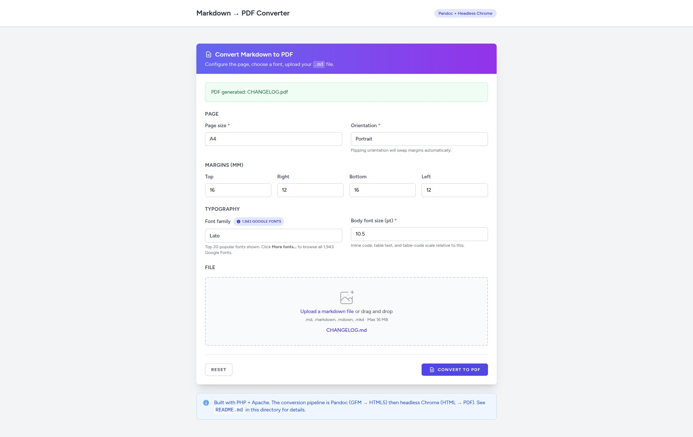

# Markdown → PDF Converter

A small PHP web app that converts an uploaded Markdown file to a styled
PDF in your browser. **Pandoc** turns the Markdown into HTML, **headless
Chrome** turns the HTML into a PDF. Single-file PHP under Apache; runs
natively or in Docker.

<p align="center">
  
</p>

---

## Quick start (Docker)

```bash
git clone <repo-url> md-to-pdf-converter
cd md-to-pdf-converter

# (optional) cp .env.example .env  — only needed to refresh the font catalog
./bin/up
```

Visit **`http://localhost:8080`**.

The seven `bin/` wrappers cover the rest of the workflow:

| | |
|---|---|
| `./bin/up` | start container (builds on first run) |
| `./bin/down` | stop + remove container |
| `./bin/restart` | restart container, no rebuild |
| `./bin/rebuild` | rebuild image + recreate container |
| `./bin/logs` | tail container logs |
| `./bin/shell` | bash shell inside the container |
| `./bin/health` | run `health_check` inside the container |

For a native install (no Docker), see [docs/installation.md](docs/installation.md).

---

## Highlights

- **AJAX submit** with overlay loader — no page redirect, PDF downloads as a Blob
- **Page controls** — A4/Letter/Legal/A3/A5, Portrait/Landscape, per-side margins (mm), body font size
- **Orientation auto-swap** — margins flip automatically when you change orientation
- **Font picker** — switchable via `.env`:
  - `FONT_SOURCE=google` (default): top 20 popular fonts + a Google-Docs-style **"More fonts…" modal** with all 1,943 Google Fonts (search, category/sort filters, checkboxes, My-fonts sidebar, lazy previews via `IntersectionObserver`)
  - `FONT_SOURCE=system`: server-installed fonts via `fc-list`, with previews streamed from disk through a secure `api/font.php` endpoint
- **Table-friendly print CSS** — inline `<code>` in tables stays on one line, table headers repeat across pages, code blocks flow across pages without leaving empty space
- **Docker image** — `php:8.4-apache` + Pandoc 3 + Chromium + Latin font pack + healthcheck

See [docs/features.md](docs/features.md) for the full feature breakdown.

---

## Documentation

| Document | What's in it |
|---|---|
| [docs/installation.md](docs/installation.md) | Docker install (recommended) and native install. System requirements, dependency commands for Ubuntu/macOS, `.env` setup. |
| [docs/usage.md](docs/usage.md) | How to use the form, output format, the `bin/` Docker wrappers, programmatic use via `curl`. |
| [docs/features.md](docs/features.md) | Deep dive: conversion pipeline, AJAX flow, font picker internals (lazy preview loading, server-streamed system fonts), print CSS, health check. |
| [docs/configuration.md](docs/configuration.md) | `includes/config.php` defaults, `.env` variables (`FONT_SOURCE`, `GOOGLE_FONTS_API_KEY`), per-request form options, customizing the print CSS. |
| [docs/troubleshooting.md](docs/troubleshooting.md) | Common issues: Pandoc / Chrome failures, fonts not previewing, permissions, slow conversions, Docker container won't start. |

---

## Repo layout

```
md-to-pdf-converter/
├── index.php                # form view (branches on FONT_SOURCE)
├── api/
│   ├── convert.php          # MD → PDF AJAX endpoint
│   └── font.php             # streams system font files (system mode)
├── includes/
│   ├── config.php           # constants / defaults
│   ├── env.php              # minimal .env loader
│   ├── fonts.php            # system font discovery via fc-list
│   ├── google_fonts.php     # reads bundled Google Fonts JSON
│   ├── validation.php       # input validation
│   └── converter.php        # pandoc + chrome + cleanup + CSS builder
├── assets/
│   ├── css/app.css          # Select2 + dropzone + alert styles
│   ├── js/app.js            # Select2, lazy preview loader, AJAX submit
│   ├── data/google_fonts.json   # bundled 1,943-family catalog
│   └── images/Markdown-to-PDF-Converter.jpg
├── bin/
│   ├── up / down / restart / rebuild / logs / shell / health
│   ├── health_check         # local-mode dependency verifier
│   └── refresh_fonts        # re-fetch Google Fonts catalog
├── docs/                    # this directory (linked above)
├── Dockerfile
├── docker-compose.yml
├── .env.example
├── .gitignore
└── README.md
```

---

## License

OSL 3.0. See the LICENSE file (or use whichever license suits your fork).
